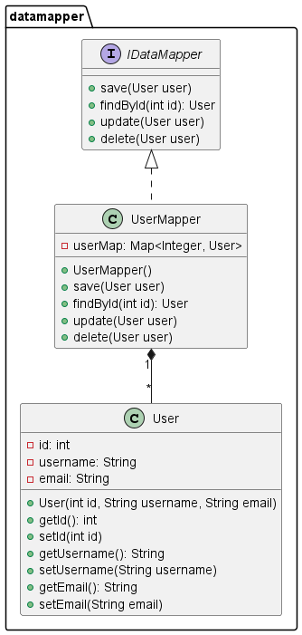

### Урок 5. Горизонтальные уровни и вертикальные срезы архитектуры

task

Реализовать любой паттерн с лекции.  
Выпустить диаграмму компонент UML по нему.  

---

#### Преобразователь Данных - Data Mapper

Преобразователь Данных — это паттерн, который выступает в роли посредника для двунаправленной передачи данных между постоянным хранилищем данных (часто, реляционной базы данных) и представления данных в памяти (слой домена, то что уже загружено и используется для логической обработки). Цель паттерна в том, чтобы держать представление данных в памяти и постоянное хранилище данных независимыми друг от друга и от самого преобразователя данных. Слой состоит из одного или более mapper-а (или объектов доступа к данным), отвечающих за передачу данных. Реализации mapper-ов различаются по назначению. Общие mapper-ы могут обрабатывать всевозоможные типы сущностей доменов, а выделенные mapper-ы будет обрабатывать один или несколько конкретных типов.

Ключевым моментом этого паттерна, в отличие от Активной Записи (Active Records) является то, что модель данных следует Принципу Единой Обязанности SOLID.

#### Диаграмма UML

