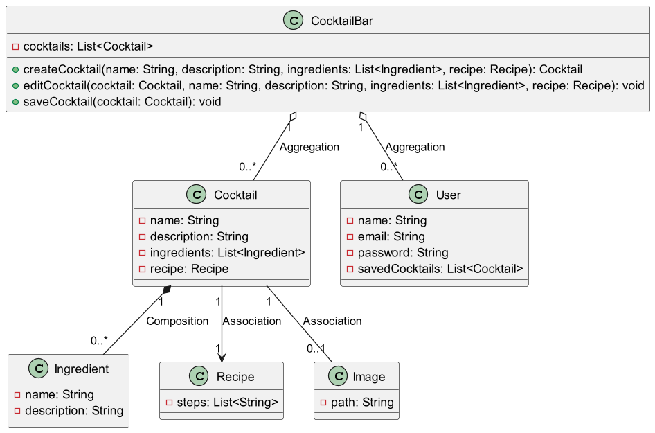
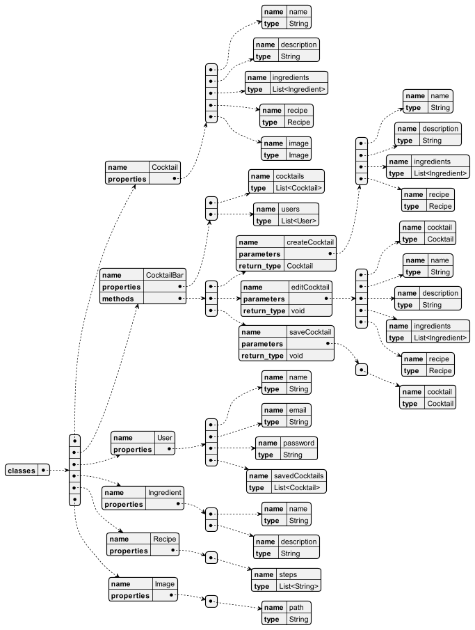
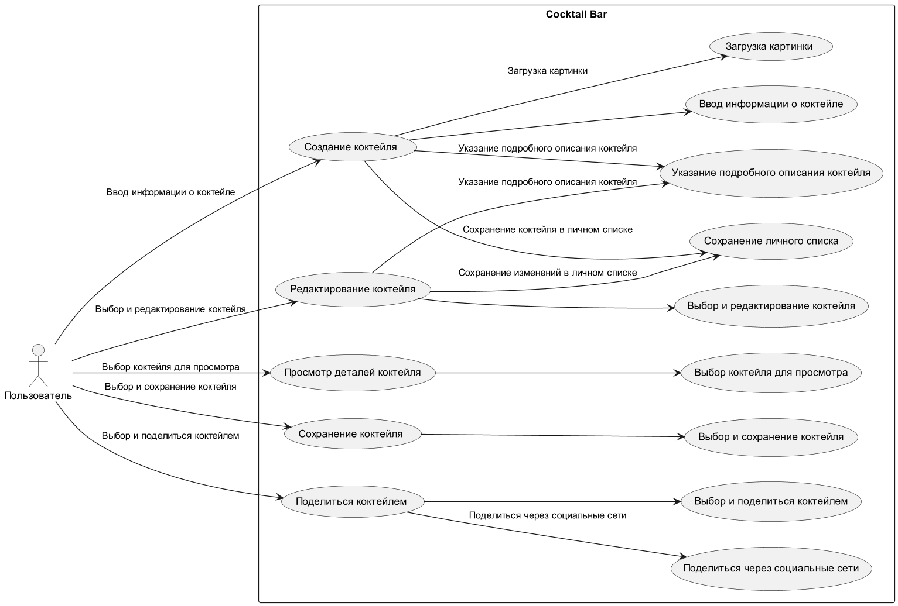

### Подготовительный этап:

 
  
Кейс

1. Подготовительный этап:
- Определение целей и задач приложения.
- Анализ аудитории и исследование рынка.
- Создание общего описания концепции и функциональности.

1 - Описать этот этап по примеру ниже, выбрать любую тему для веб приложение.  
2 - Пункт 1.7 - необходимо сделать сырой пример страницы, прислать скриншот любой страницы
(https://www.figma.com или воспользоваться другим инструментом), то есть физичекси указать
примерные цвета, расположение кнопок и т.д. можно взять за основу мобильную версию ,
т к ее проще делать. (Вы не дизайнеры, но дизайнер дорден понять Вашу мысль, чтобы сдедать
красило по шаблону)

---

Cocktail Bar - это приложение, которое позволяет пользователям создавать и сохранять
свои любимые коктейли в одном месте.   
Благодаря этому приложению, пользователи смогут добавлять
информацию о каждом коктейле, такую как название, описание, список ингредиентов и рецепт
его приготовления.  
Cocktail Bar - это платформа для хранения информации о ваших любимых
напитках, а также для обмена рецептами и впечатлениями с друзьями!

**Основные функциональности:**

Создание коктейлей:

Пользователи могут легко создавать новые записи о своих любимых коктейлях.   
Возможность загрузки картинки для каждого коктейля дает возможность добавить визуальную
привлекательность.

Детализированная информация:

Для каждого созданного пользователем коктейля можно указать
подробное описание со всеми необходимыми деталями:  
название, рецепт, а также список всех используемых ингредиентов.   
При необходимости, описание коктейля можно изменить позже.

Сохранение и обмен:

Каждый созданный пользователем коктейль сохраняется в личном списке,
доступном только для него.   
Однако при желании вы можете поделиться своими любимыми рецептами
с друзьями через социальные сети или мессенджеры.

https://www.figma.com/file/5snmSJiiHGhetcG83qfpoR/Untitled?type=design&node-id=0-1&mode=design&t=ao9UOrjUhwWEj7Yp-0

---

### Создание UML диаграммы классов для веб-приложения.
### Вам также необходимо создать YAML-диаграмму для этой диаграммы классов.

 
  
Кейс

Задание: Создание UML диаграммы классов для веб-приложения
(Любого, но лучге взять за основу прдидущее)

---

Пример. Вы работаете над проектированием веб-приложения для онлайн-магазина книг. 
Вам нужно создать UML-диаграмму классов, отображающую связи между основными классами 
вашего приложения. Вам также необходимо создать YAML-диаграмму для этой диаграммы классов.

---

Инструкции:

---

Определите основные классы, которые будут присутствовать в вашем веб-приложении. 
Например, классы "Пользователь", "Книга", "Корзина", "Заказ" и другие.
Определите связи между этими классами. Например, класс "Пользователь" может иметь 
ассоциацию с классом "Корзина", а класс "Корзина" может иметь ассоциацию с классом "Книга".
Создайте UML-диаграмму классов, на которой отобразите классы и связи между ними. 
Не включайте методы и поля, только связи между классами.
Создайте YAML-диаграмму для этой UML-диаграммы классов. В YAML-диаграмме укажите 
только имена классов и связи между ними.
Примечание:

---

Ваша UML-диаграмма должна визуализировать связи между классами, такие как ассоциации, 
агрегации и композиции.
Ваша YAML-диаграмма должна быть валидным YAML-файлом и отражать связи между классами.
Вы можете использовать любой инструмент для создания диаграмм, такой как draw.io, 
Lucidchart или даже бумагу и карандаш.

На основании данного задания можно выделить следующие классы:

**Cocktail (Коктейль)**: Класс, представляющий информацию о коктейле, включая его название, 
описание, список ингредиентов и рецепт приготовления.

**CocktailBar (Бар с коктейлями)**: Класс, представляющий платформу для хранения информации 
о коктейлях. В этом классе можно реализовать функциональности для создания, 
редактирования и сохранения коктейлей.

**User (Пользователь)**: Класс, представляющий пользователя приложения Cocktail Bar. 
Он может содержать информацию о пользователе, такую как имя, электронная почта, 
пароль и список сохраненных коктейлей.

**Ingredient (Ингредиент)**: Класс, представляющий информацию об отдельном ингредиенте, 
который может использоваться в коктейлях. Он может содержать информацию о названии
ингредиента, его описании и других свойствах.

**Recipe (Рецепт)**: Класс, представляющий рецепт приготовления коктейля. Он может 
содержать информацию о последовательности шагов, необходимых ингредиентах и других деталях.

**Image (Изображение)**: Класс, представляющий изображение коктейля. Он может содержать 
информацию о самом изображении, такую как путь к файлу или URL.

Отношения между классами:

1. **CocktailBar и Cocktail**: Агрегация "1 к 0 или более". Каждый CocktailBar содержит
ноль или более экземпляров класса Cocktail. Это означает, что CocktailBar агрегирует 
(содержит) коктейли.

2. **CocktailBar и User**: Агрегация "1 к 0 или более". Каждый CocktailBar содержит 
ноль или более экземпляров класса User. Это означает, что CocktailBar агрегирует 
(содержит) пользователей.

3. **Cocktail и Ingredient**: Композиция "1 к 0 или более". Каждый Cocktail состоит 
из нуля или более экземпляров класса Ingredient. Это означает, что Cocktail 
композирует (состоит из) ингредиентов.

4. **Cocktail и Recipe**: Ассоциация "1 к 1". Каждый Cocktail связан с одним экземпляром 
класса Recipe. Это означает, что у каждого коктейля есть свой рецепт приготовления.

5. **Cocktail и Image**: Ассоциация "1 к 0 или 1". Каждый Cocktail может иметь 
необязательное изображение, представленное экземпляром класса Image. Это означает, 
что у коктейля может быть опциональное изображение.

#### UML диаграмма

#### YAML диаграмма

#### Use case диаграмма

